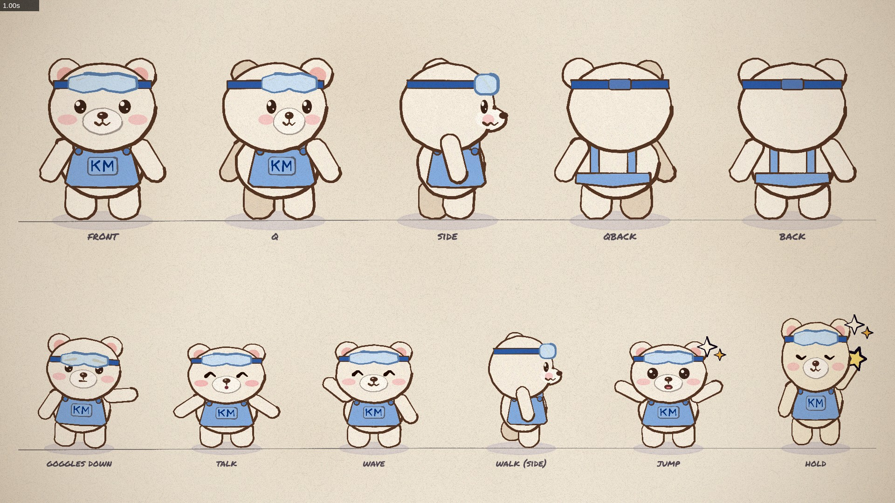
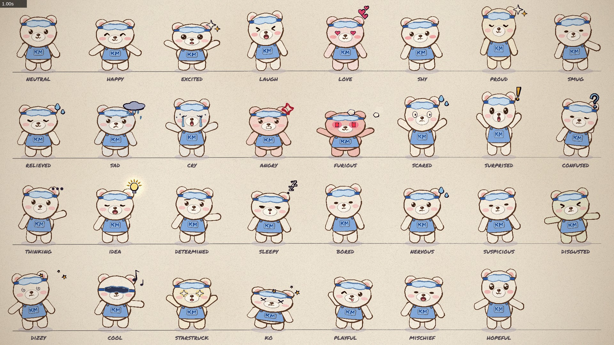

# KMBearAnimationBase：开明小熊手绘动画底座

用 p5.js + p5.brush 画开明小熊（KM Bear）的动画套件，和 `../ClaudeAnimationBase` 同一套引擎、同一套规则。
小熊与 Clawd 可以同台：`src/clawd.js` 一并带着，表情库、舞步、转身都通用。




## 快速开始

```bash
npm install
node render.mjs --sheet=1,3,5 --soft-gl --out=out/check.jpg     # 无显卡机器：软件渲染 + 平涂（1080p 每帧约 3 秒）
node render.mjs --clip --out=out/demo.mp4                         # 有显卡机器：原版水彩
node render.mjs --clip --soft-gl --out=out/demo.mp4               # 无显卡机器出片
```
浏览器找不到时加 `--chrome=<路径>` 或设 `CHROME_PATH`。`studio.html` 用 Chrome 打开可拖动时间轴。

先读 `ANIMATION_GUIDE.md`（引擎规则、动画原则、自检流程，原文沿用 ClaudeAnimationBase），再读下面的小熊说明。

## 小熊

```js
kmbear(x, y, u, options)   // (x, y) = 两脚之间的地面点；u = 尺寸单位。小熊约 9u 宽、13.6u 高
```

| 镜头 | u |
|---|---|
| 远景 | 8–14 |
| 中景 | 18–30 |
| 特写 | 40–70 |

**造型（来自 KMBear release 的原设，见 `reference/`）**：奶油白熊、深棕眼睛、粉色腮红、额头浅蓝护目镜配深蓝绑带、
雾蓝短工作围兜（两颗扣子、胸口 KM 口袋）、手臂末端是完整圆掌、粗短四肢、宽耳根。同一部片子里保持这套造型不变。

| 选项 | 说明 |
|---|---|
| 姿态 | `dx` `dy` `sq` `rot` `flip` `sx` `sy` `walk` `noLegs` `noShadow`，与 Clawd 相同 |
| 手臂 | `aL` `aR`，沿用 Clawd 的数值（0 平伸、+ 上举、1.5 竖直）；小熊静止时手臂自然下垂。`armL` `armR` 挂点在圆掌中心 |
| 视角 | `view`: front / q / side / qback / back；`turn()` `spinView()` 通用；`smear` 甩动拖影 |
| 表情 | `feel(name, t)` 与 `emotions(t, keys)` 通用，31 种表情全部可用；`eyes` `mouth` `lookX` `lookY` `squint` `blush` |
| 小熊专属 | `goggles` 0..1（0 在额头，1 拉下遮眼，「开工」的动作）；`talk` 0..1 张嘴说话，配 `speak(t, t0, t1)`；`eyes: 'shades'` 护目镜变墨镜；`noGoggles` `noBlush` `furCol` `bibCol` |
| 挂点 | `draw(u, sw)` 身体局部坐标：胸口口袋 (0, -4.5u)、头心 (0, -9.5u)、眼睛 (±1.8u, -9.55u) |
| 其他 | `emote` `emoteK` `emoteAge` `tint` `tintK` `boilKey`，与 Clawd 相同 |

```js
kmbear(900, 900, 26, { ...emotions(lt, [[0, 'thinking'], [1.5, 'idea']]), talk: speak(lt, 2, 4) });
kmbear(900, 900, 26, { ...move('wave', t), goggles: seg(lt, 1, 1.4) });
clawd(1250, 900, 18, { ...feel('happy', t), flip: true });   // 同台
```

## 与 ClaudeAnimationBase 的区别

| 项 | 本套件 |
|---|---|
| 角色 | 开明小熊（`src/kmbear.js`）+ Clawd |
| 平涂模式 | `--flat` / `--soft-gl` 自动启用：水彩填充改成等效平涂，无显卡机器 1080p 每帧约 3 秒（水彩填充时 40 秒以上）；接触表打印的 ms/frame 只算下发绘制指令，真实耗时在读回画面时 |
| 字体 | 本地字体，离线可用：Permanent Marker（Apache 2.0）、得意黑 Smiley Sans（OFL，中文） |
| 中文字 | `letter(txt, x, y, size, col, { font: '64px Smiley' })` |

## 素材

完整原设素材包（2D 透明图、分层、口形、3D 参考、演示视频，约 450MB）在
[KMBear release](https://github.com/LinzeColin/KMOS/releases/tag/KMBear)，不进本目录。本目录 `reference/` 只放三视图与表情的缩略参考。

## 许可

`src/core.js` `src/timeline.js` `src/clawd.js` `render.mjs` `gpu_probe.mjs` `ANIMATION_GUIDE.md` 来自
ClaudeAnimationBase（MIT，© 2026 John Heibel），见 `LICENSE`。开明小熊的造型、`src/kmbear.js`、`src/sheets.js`、
`src/scenes/`、`reference/` 属于武汉开明高新科技有限公司，不对外授权。
