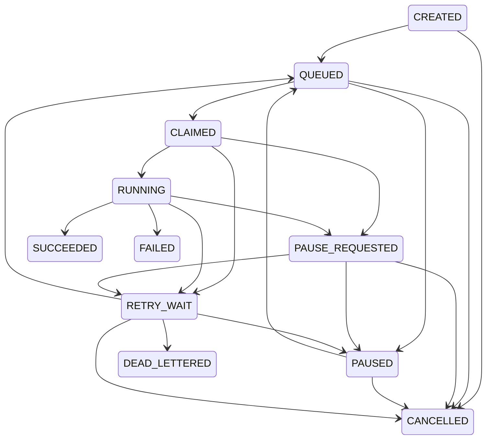

# STAGE-038 Phase 4 - Worker Queue Closeout

## Identity

- Stage: `STAGE-038 · Worker 队列基线`
- Task: `IDS-V0_1-STAGE038-P4`
- Acceptance: `ACC-STAGE-038`
- Delivery schema: `ids.stage038.worker_queue_baseline.delivery.v1`
- Report schema: `ids.stage038.worker_queue_baseline.phase4.report.v1`
- Execution mode: `ISOLATED_NON_PRODUCTION_CLOSEOUT_EVIDENCE`
- Result: `PASS_ISOLATED_CLOSEOUT_PRODUCTION_DISABLED`
- Review state: `stage_review_status=pending_next_run`
- Next gate: `IDS-STAGE038-REVIEW-GATE`
- Marker: `NO_STAGE_REVIEW_THIS_RUN`

## Delivery Boundary

Phase 4 binds the exact STAGE-037 state model and the committed Phase 2/3
contracts and evidence by SHA-256. The checker reruns only isolated
non-production control work over real Git-tracked project documents. It writes
no queue row, database row, log file, report, checkpoint file, cleanup
manifest, evidence ledger, audit log, or runtime output.

This closeout is not whole-stage review and is not production readiness.
`push_allowed=false`; GitHub upload, PR, merge, issue mutation, app reinstall,
STAGE-039, and batch gates remain disabled.

## Job State Graph

The delivery report exposes the exact `ids.job_state.v1` graph: 8 job types,
11 states, 4 terminal states, and 21 directed transitions. STAGE-037 remains
the authority; STAGE-038 does not create a second lifecycle model.



No state-registry write or persistent transition is performed by this graph
render.

## failure_retry_log

The checker reuses the actual isolated Phase 3 worker exception:

- state history: `QUEUED -> CLAIMED -> RUNNING -> FAILED`;
- bounded error: `error:RuntimeError`;
- output refs: empty;
- checkpoint ref: null;
- transition audit: three accepted in-memory transition candidates;
- `baseline_max_retries=0`;
- retry disposition:
  `NOT_AVAILABLE_BASELINE_MAX_RETRIES_ZERO_STAGE039_OWNED`;
- owner action:
  `REVIEW_ERROR_NO_SAME_OPERATION_RESUBMISSION_UNTIL_STAGE039`;
- same-operation replay result: `EXISTING_QUEUE_ENTRY` with no second
  invocation; STAGE-039 owns retry/new-attempt policy.

This is a real isolated exception record, not a fabricated failure log.
`automatic_retry_performed=false`, `retry_scheduler_performed=false`, and
`dead_letter_runtime_performed=false`. STAGE-039 retains retry and dead-letter
runtime ownership.

## Backpressure Trigger Proof

The report delivers five bounded signals:

1. Capacity: a capacity-one queue accepts one real control reference and
   returns `QUEUE_CAPACITY_REACHED` with Chinese `已暂停` for a second distinct
   real tracked reference before any worker starts.
2. External drive: `PAUSED_EXTERNAL_DRIVE_OFFLINE` is a control-gate input;
   no physical drive event is claimed.
3. Low disk: actual project-volume free bytes are observed and a required-byte
   boundary of free plus one returns `PAUSED_LOW_DISK` without allocation.
4. External API budget: an API-required control gate with budget unavailable
   returns `PAUSED_EXTERNAL_API_BUDGET_INSUFFICIENT` before queue admission;
   no API call is made.
5. Same source: a second active archive/parse/index/report operation returns
   `RESOURCE_CONFLICT_ACTIVE` before creating another queue record.

These are admission and resource signals, not measured throughput or fairness.
`measured_backpressure_runtime_performed=false` and
`automatic_resume_performed=false`; STAGE-040 retains runtime ownership.

## Cleanup Allowlist

Only these artifact classes are eligible for a future cleanup manifest:

- `TEMPORARY_PARTIAL_OUTPUT`
- `REBUILDABLE_CACHE`

Every future candidate still requires `cleanup_manifest_ref`, approved-root
identity, root-relative path, immutable lstat identity, symlink blocking,
exclusive namespace lock, writer quiescence, and no-follow traversal.

These classes are always protected:

- `ORIGINAL_RAW_DATA`
- `FACT_SOURCE`
- `MANIFEST`
- `EVIDENCE_LEDGER`
- `REPORT_SNAPSHOT`
- `AUDIT_LOG`
- `ACTIVE_INDEX`
- `REQUIRED_CHECKPOINT`

Phase 3 real Git-tracked checks remain `PROTECTED_ARTIFACT`. No delete API is
called: `cleanup_runtime_performed=false` and
`delete_attempt_performed=false`. STAGE-044 retains cleanup runtime ownership.

## Automatic And Manual Recovery

`automatic_recovery_cases=[]` for the STAGE-038 baseline. Duplicate replay is
an idempotent no-op response, not recovery. The following conditions require
manual action or later-stage runtime:

| Condition | Required action |
|---|---|
| `WORKER_EXCEPTION` | Review the bounded error. Same-operation resubmission is unavailable until STAGE-039 defines retry/new-attempt policy. |
| `EXTERNAL_DRIVE_OFFLINE` | Reconnect, then complete owner and resource revalidation. |
| `LOW_DISK` | Restore capacity, then complete owner and resource revalidation. |
| `QUEUE_CAPACITY_REACHED` | Wait and resubmit only after capacity review. |
| `SAME_SOURCE_CONFLICT` | Wait for the holder to become terminal, then resubmit. |
| `PROCESS_RESTART` | Recreate the in-memory queue and a new job from a durable source ref. |

There is no persistent recovery after process exit. STAGE-042 owns automatic
lifecycle; STAGE-043 owns crash recovery. This Phase does not auto-resume,
recover a process, or rewrite terminal history.
`same_operation_resubmission_available=false` and
`same_operation_resubmission_owner=STAGE-039`.

## Safe Shutdown

The checker proves an orderly isolated shutdown with one real tracked control
job:

1. `STOP_NEW_ADMISSION`
2. `DRAIN_ACCEPTED_CONTROL_WORK`
3. `VERIFY_TERMINAL_STATE_AND_RELEASED_LOCKS`
4. `STOP_ISOLATED_WORKER`

The accepted record reaches `SUCCEEDED`, all in-process resource locks are
released, the worker stops, and a later submission returns `QUEUE_CLOSED`.
No active work is cancelled. This is not automatic production shutdown and
does not provide persistent restart recovery.

## Recovery And Rollback

Recovery is limited to new in-memory work after owner revalidation. Existing
terminal history is not mutated. If any delivery source, graph, failure,
backpressure, cleanup, recovery, or shutdown check fails:

1. `STOP_ON_INVALID_DELIVERY_CONTRACT`
2. `REVERT_PHASE4_FILES_ONLY`
3. `PRESERVE_PHASE1_PHASE3_EVIDENCE`
4. `PRESERVE_RAW_DATA_AND_DURABLE_EVIDENCE`

Rollback removes only the Phase 4 checker, machine contract, closeout,
focused/compatibility tests, governance projection, and rendered owner views.
It does not alter prior Phase evidence, user-owned dirty files, raw metadata,
databases, manifests, evidence ledgers, audit logs, reports, indexes, app
entries, or GitHub state.

## Known Limits

- no persistent queue or claim transport;
- no automatic retry or dead-letter runtime;
- no measured backpressure or fairness runtime;
- no production lock, lease, renewal, or fencing;
- no automatic lifecycle or process crash recovery;
- no cleanup runtime;
- no PostgreSQL or IDS business-source access;
- static closeout does not prove production readiness.

## Truth Contract

- `delivery_contract_valid=true`
- `execution_ready=false`
- `production_runtime_activation_performed=false`
- `claim_persistence_performed=false`
- `persistent_queue_write_performed=false`
- `retry_scheduler_performed=false`
- `measured_backpressure_runtime_performed=false`
- `production_lock_runtime_performed=false`
- `automatic_lifecycle_runtime_performed=false`
- `crash_recovery_runtime_performed=false`
- `cleanup_runtime_performed=false`
- `database_connection_performed=false`
- `runtime_output_written=false`
- `ids_business_source_read_performed=false`
- `raw_metadata_content_accessed=false`
- `fake_ids_business_data_used=false`
- `whole_stage_review_performed=false`
- `github_upload_allowed=false`
- `app_reinstall_allowed=false`

`/Users/linzezhang/Downloads/IDS_MetaData` remains path-only governance
context and was not read, listed, hashed, opened, copied, moved, deleted,
modified, dumped, or scanned.

## Validation

```bash
python3 -B -m unittest -q KM_IDSystem.docs.pursuing_goal.ids_v0_1.tests.test_stage038_worker_queue_delivery
python3 -B KM_IDSystem/scripts/check_worker_queue_delivery.py
python3 -B KM_IDSystem/docs/pursuing_goal/ids_v0_1/validate_stage005_governance_regression.py
python3 -B -m unittest discover -s KM_IDSystem/docs/pursuing_goal/ids_v0_1/tests -q
python3 -B scripts/lean_governance.py check-render --project KM_IDSystem
python3 -B scripts/validate_governance_sync.py --changed-only --base-ref HEAD --semantic --drift-report
```

## 中文 Owner 反馈

Stage 38 四个 Phase 的本地交付证据已齐备。隔离队列可以在请求返回后处理真实
Git-tracked 控制引用，并已验证异常、容量、移动介质、磁盘、API 预算、同源冲突和顺序关闭；但当前
没有自动重试、持久恢复、生产锁或清理运行时。任何失败、设备离线、磁盘不足、
容量满、同源冲突或进程重启都需要人工复核。下一轮只能执行整阶段复审，复审和
修复完成前不得进入 STAGE-039、GitHub 或 app 重装。
