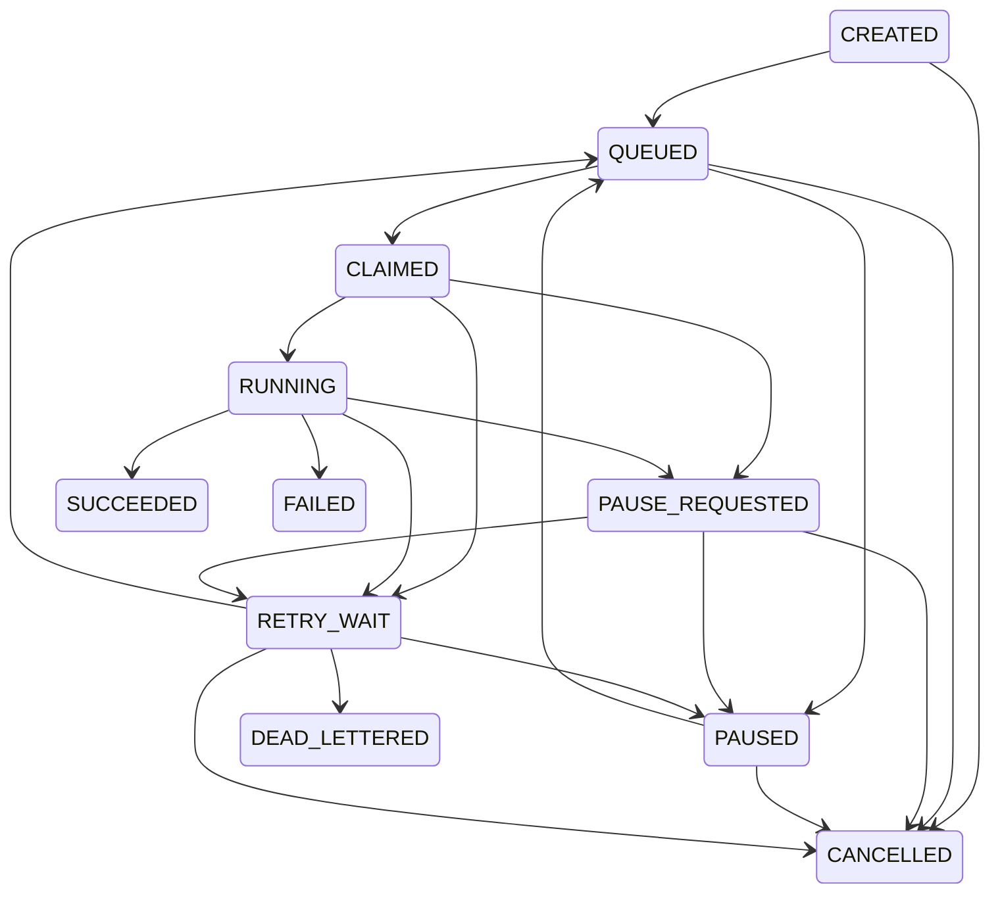
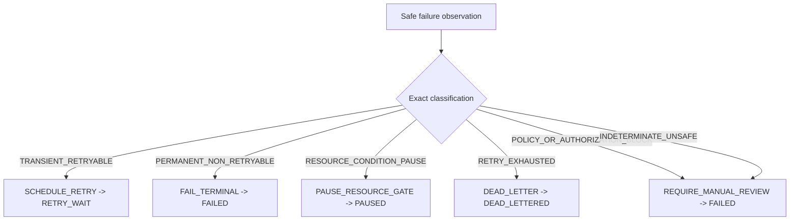

# STAGE-039 Phase 4 - Retry And Dead-Letter Closeout

## Identity

- Stage: `STAGE-039 · 重试与死信策略`
- Task: `IDS-V0_1-STAGE039-P4`
- Acceptance: `ACC-STAGE-039`
- Delivery schema: `ids.stage039.retry_dead_letter.phase4.delivery.v1`
- Report schema: `ids.stage039.retry_dead_letter.phase4.report.v1`
- Policy: `ids.retry_policy.v0_1.stage039.p2`
- Execution mode: `ISOLATED_NON_PRODUCTION_CLOSEOUT_EVIDENCE`
- Result: `PASS_ISOLATED_CLOSEOUT_PRODUCTION_DISABLED`
- Review state: `stage_review_status=pending_next_run`
- Next gate: `IDS-STAGE039-REVIEW-GATE`
- Marker: `NO_STAGE_REVIEW_THIS_RUN`

The exact Stage039 taskpack member, roadmap, and instructions remain source
verified. The machine contract binds the committed Stage037 state model,
reviewed Stage038 delivery boundary, and Stage039 Phase 1-3 contract, checker,
and evidence files by SHA-256. Phase 4 reruns only isolated control-reference
checks. It writes no queue row, database row, retry log file, report, cleanup
manifest, audit event, or runtime output.

This closeout is not whole-stage review and is not production readiness.
`push_allowed=false`; GitHub upload, PR, merge, issue mutation, app reinstall,
STAGE-040, and batch gates remain disabled.

## State And Decision Graph

Stage037 remains the sole authority for `ids.job_state.v1`: 8 job types, 11
states, 4 terminal states, and 21 directed transitions. Phase 4 renders the
same graph without writing a second state registry.



The decision graph preserves the six Phase 1 exact classifications. Message
substrings never classify a failure.



## failure_retry_dead_letter_log

The checker reruns the actual Phase 2 isolated control-metadata path over one
real Git-tracked project document. Its bounded state history is:

```text
QUEUED -> CLAIMED -> RUNNING -> RETRY_WAIT
       -> QUEUED -> CLAIMED -> RUNNING -> RETRY_WAIT
       -> QUEUED -> CLAIMED -> RUNNING -> RETRY_WAIT -> DEAD_LETTERED
```

- attempts: `3`;
- retry admissions: `2`;
- final `retry_count=2`, `max_retries=2`;
- final disposition: `exhausted`;
- final Chinese status: `需要人工处理`;
- output refs: empty;
- input ref: one Git-tracked `repo:KM_IDSystem/...` control reference;
- checkpoint: actual SHA-256 of the tracked control document;
- safe error: `TRANSIENT_OPERATION_TIMEOUT`;
- persistence: false;
- raw payload copy: false.

Reservation does not consume retry budget; due admission increments exactly
once. The third failure transitions through `RETRY_WAIT` to `DEAD_LETTERED`.
Terminal replay remains blocked and no automatic dead-letter replay exists.

## Backpressure Trigger Proof

The closeout combines reviewed Stage038 capacity evidence with Stage039 Phase 3
retry-resource scenarios:

1. Capacity-one transport returns `QUEUE_CAPACITY_REACHED` for the second
   distinct tracked control ref before a worker starts.
2. External-drive-offline control gating moves pending retry to `PAUSED` with
   `retry_count=0`; no physical removal is performed.
3. Actual local free-space observation feeds the controlled low-disk boundary;
   pending retry pauses with no disk allocation and no budget consumption.
4. External API budget unavailability pauses pending retry without an API call
   or budget consumption.
5. One active source operation allows one invocation; the other three of
   `ARCHIVE`, `PARSE`, `INDEX`, and `REPORT` receive resource conflicts.

These are bounded admission/resource signals, not measured throughput,
fairness, automatic resume, or production backpressure. STAGE-040 owns measured
backpressure; STAGE-041 owns production lock/lease/fencing; STAGE-042 owns
automatic resume.

## Cleanup Allowlist

Only two artifact classes are eligible for a future cleanup manifest:

- `TEMPORARY_PARTIAL_OUTPUT`
- `REBUILDABLE_CACHE`

Every candidate still requires approved-root identity, root-relative path,
immutable lstat identity, symlink blocking, exclusive namespace lock, writer
quiescence, and no-follow traversal.

These classes are always protected:

- `ORIGINAL_RAW_DATA`
- `FACT_SOURCE`
- `MANIFEST`
- `EVIDENCE_LEDGER`
- `REPORT_SNAPSHOT`
- `AUDIT_LOG`
- `ACTIVE_INDEX`
- `REQUIRED_CHECKPOINT`

The five Phase 3 exact Git-tracked protected-ref checks all return
`PROTECTED_ARTIFACT`. No delete API or cleanup runtime runs. STAGE-044 retains
cleanup execution ownership.

## Automatic Eligibility And Manual Handling

Only `TRANSIENT_DEPENDENCY_UNAVAILABLE` and
`TRANSIENT_OPERATION_TIMEOUT` can enter the controlled retry path, and only
when all of these conditions pass: exact versioned policy, exact safe-code
allowlist match, remaining retry budget, resource gates, compare-and-set, and
idempotency key.

The Phase 2 path proves controlled retry admission, but it does not prove a
successful automatic recovery: `successful_automatic_recovery_cases_observed=[]`.

| Condition | Required handling |
|---|---|
| retry exhausted | Keep `DEAD_LETTERED`; require manual triage. |
| permanent failure needs continuation | Review evidence and prepare an owner-authorized new-lineage candidate; job creation is not implemented. |
| unknown or missing safe error code | No automatic retry; require manual review. |
| policy or authorization block | Stop safely and require manual review. |
| worker process lost | Keep failed evidence; STAGE-043 owns process recovery. |
| resource gate unavailable | Restore the resource and complete owner revalidation; no automatic resume. |
| same-source conflict | Wait for a terminal holder and revalidate before new work. |
| terminal manual rerun | Validate only an owner-authorized new-lineage candidate; no job is created and history is never reopened. |

The Phase 3 manual rerun remains `candidate_only=true`, `persisted=false`, and
`job_created=false`; duplicate owner request replay is idempotent.

## Safe Shutdown And Recovery

The reviewed Stage038 transport proves orderly isolated shutdown: accepted
control work reaches a terminal state, the queue closes, all in-process locks
release, active work is not cancelled, and later submission returns
`QUEUE_CLOSED`.

Stage039 has no persistent scheduler or process to terminate. Its retry
shutdown instructions are:

1. `STOP_NEW_RETRY_RESERVATIONS`
2. `FREEZE_DUE_RETRY_ADMISSION`
3. `PRESERVE_TERMINAL_AND_PENDING_SNAPSHOTS`
4. `VERIFY_NO_PERSISTENT_OR_RUNTIME_OUTPUT`
5. `REQUIRE_OWNER_REVALIDATION_BEFORE_NEW_SESSION`

After process exit, the in-memory retry state is not recoverable. Recovery is
limited to exact source/policy verification, owner and resource revalidation,
and validation of a new linked-job candidate for a terminal source. This Stage
does not create that job, and terminal history is never reopened.
STAGE-043 retains process-crash recovery ownership.

## Rollback

If any source, contract, state graph, failure log, backpressure, cleanup,
recovery, shutdown, or truth check fails:

1. `STOP_ON_INVALID_DELIVERY_CONTRACT`
2. `NO_AUTOMATIC_RETRY`
3. `STOP_NEW_RETRY_RESERVATIONS`
4. `REVERT_PHASE4_FILES_ONLY`
5. `PRESERVE_PHASE1_PHASE3_EVIDENCE`
6. `PRESERVE_RAW_DATA_AND_DURABLE_EVIDENCE`

Rollback is non-destructive. It preserves the four owner-authored dirty files,
raw metadata, databases, manifests, evidence ledgers, audit logs, reports,
indexes, app entries, GitHub state, and Stage037-039 Phase 1-3 evidence.

## Known Limits

- no persistent retry or dead-letter queue;
- no successful automatic recovery observed;
- no measured backpressure or fairness runtime;
- no production lock, lease, renewal, or fencing;
- no automatic resume or lifecycle runtime;
- no process-crash recovery;
- no cleanup runtime;
- no database or raw-source access;
- Phase 2 policy values remain uncalibrated `PROPOSED` values;
- static closeout does not prove production readiness.

## Truth Contract

- `delivery_contract_valid=true`
- `execution_ready=false`
- `production_runtime_activation_performed=false`
- `persistent_queue_write_performed=false`
- `database_connection_performed=false`
- `runtime_output_written=false`
- `ids_business_source_read_performed=false`
- `raw_metadata_content_accessed=false`
- `fake_ids_business_data_used=false`
- `real_ids_business_job_created=false`
- `measured_backpressure_runtime_performed=false`
- `production_lock_runtime_performed=false`
- `automatic_lifecycle_runtime_performed=false`
- `process_crash_recovery_performed=false`
- `cleanup_runtime_performed=false`
- `whole_stage_review_performed=false`
- `github_upload_allowed=false`
- `app_reinstall_allowed=false`

`/Users/linzezhang/Downloads/IDS_MetaData` remains path-only governance
context and was not read, listed, hashed, opened, copied, moved, deleted,
modified, dumped, or scanned.

## Validation

- TDD red: `10/10` tests failed because the Phase 4 contract, checker,
  evidence, and governance transition did not yet exist.
- Phase 4 checker: `14/14` contract checks and `7/7` delivery checks true,
  `delivery_contract_valid=true`, result
  `PASS_ISOLATED_CLOSEOUT_PRODUCTION_DISABLED`.
- Stage039: `41/41` tests passed.
- Stage005: `146/146` governance regression tests passed. The direct validator
  fails closed only on the four preserved owner-authored dirty paths; source,
  event, phase-state, boundary, and project-path checks are otherwise clean.
- Stage031-039 aggregate: `248/248` tests passed.
- Stage026-030 compatibility: `75/75` tests passed (`63` for Stage026-029 and
  `12` for Stage030).
- Full IDS v0.1 discovery: `654/654` tests passed.
- Owner render: `drift_count=0`, `reference_issue_count=0`.
- Events: `186` JSONL records, `0` duplicate IDs, exactly `1` Phase 4 event.
- Python in-memory compilation: `5/5` changed Python files passed without
  writing project runtime output.
- `git diff --cached --check` passed.
- Changed-only semantic governance: `errors=0`, `warnings=0`.
- Project-wide Lean semantic validation remains diagnostic rather than green:
  `50` findings comprise `29` sparse-worktree missing root/unrelated-project
  paths and `21` pre-existing Stage039 Phase 2 registry/schema/count findings
  (`isolated_non_production`, `ASSUMPTION`, unresolved references, and
  `MODEL_SPEC` 7/8 plus 49/55 drift). Phase 4 changes introduce no changed-scope
  governance error. These findings are mandatory inputs to the separate
  whole-stage review; sparse scope was not expanded and registries were not
  altered in this closeout.
- Pre-commit implementation review repaired one Important fail-closed gap:
  non-object `delivery_contract` tampering now returns a structured blocked
  Phase 4 report instead of raising while preparing the blank report.
- `push_allowed=false`.
- Whole-stage review did not run.

## 中文 Owner 反馈

Stage 39 四个 Phase 的本地交付证据已齐备，当前仅允许进入独立整阶段复审。
只有精确白名单错误、有效版本策略、剩余预算和全部资源门同时满足时，任务才可进入
受控重试；本轮未观察到自动恢复成功。重试耗尽、未知错误、策略或授权缺失、进程
丢失、资源门未恢复、同源冲突和终态重跑均需人工复核。当前不是生产运行或生产
就绪证明，不提供持久恢复、自动恢复、进程崩溃恢复或清理运行时。
