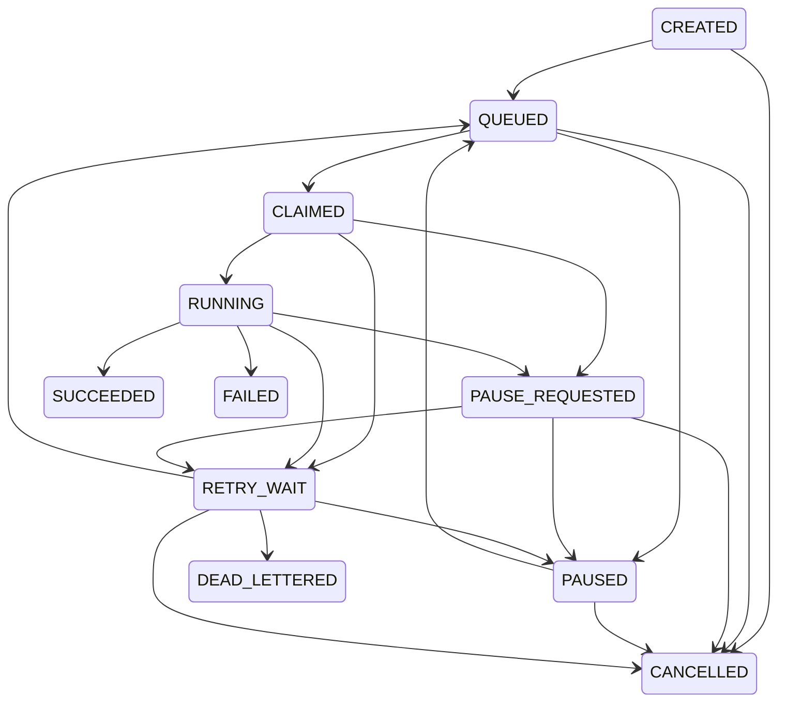
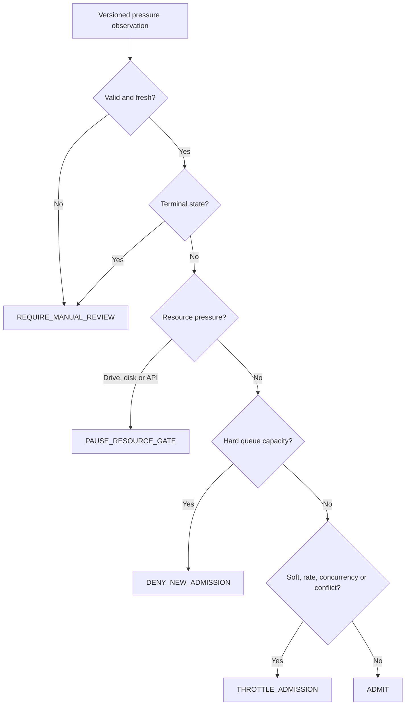

# STAGE-040 Phase 4 - Backpressure Closeout

## Identity

- Stage: `STAGE-040 · 反压策略`
- Task: `IDS-V0_1-STAGE040-P4`
- Acceptance: `ACC-STAGE-040`
- Delivery schema: `ids.stage040.backpressure.phase4.delivery.v1`
- Report schema: `ids.stage040.backpressure.phase4.report.v1`
- Policy: `ids.backpressure_policy.v0_1.stage040.p2`
- Execution mode: `ISOLATED_NON_PRODUCTION_CLOSEOUT_EVIDENCE`
- Result: `PASS_ISOLATED_CLOSEOUT_PRODUCTION_DISABLED`
- Review state: `stage_review_status=pending_next_run`
- Next gate: `IDS-STAGE040-REVIEW-GATE`
- Marker: `NO_STAGE_REVIEW_THIS_RUN`

The exact Stage040 taskpack member, roadmap, and instructions remain source
verified. The machine contract binds the committed Phase 3 state, Stage037 job
state model, reviewed Stage039 delivery, and every Stage040 Phase 1-3 contract,
checker, and evidence file by SHA-256.

Phase 4 reruns only isolated control-metadata checks. It writes no queue row,
database row, retry log file, pressure report, cleanup manifest, audit log, or
runtime output. The observed project-volume free-space value appears only in
stdout and is not persisted in the contract or evidence file.

This closeout is not whole-stage review and is not production readiness.
`push_allowed=false`; Stage040 review, the tenth-stage batch review/upload
gates, GitHub actions, issue mutation, app reinstall, and STAGE-041 remain
disabled.

## Job State And Backpressure Decision Graphs

Stage037 remains the sole authority for `ids.job_state.v1`: 8 job types, 11
states, 4 terminal states, and 21 directed transitions. Phase 4 renders the
same graph without writing another state registry.



The backpressure decision graph preserves the Phase 1 precedence and the
Phase 2 versioned policy. Unknown, stale, or terminal inputs fail closed.



## Failure And Retry Log

Stage040 does not invent a retry log. The checker reruns the reviewed Stage039
Phase 4 delivery path, which in turn reruns the actual isolated control-metadata
failure sequence over one real Git-tracked project document:

```text
QUEUED -> CLAIMED -> RUNNING -> RETRY_WAIT
       -> QUEUED -> CLAIMED -> RUNNING -> RETRY_WAIT
       -> QUEUED -> CLAIMED -> RUNNING -> RETRY_WAIT -> DEAD_LETTERED
```

- source: `STAGE039_REVIEWED_PHASE4_ACTUAL_ISOLATED_CONTROL_METADATA`;
- attempts: `3`;
- retry admissions: `2`;
- final `retry_count=2`, `max_retries=2`;
- final state: `DEAD_LETTERED`;
- disposition: `exhausted`;
- Chinese status: `需要人工处理`;
- input: one Git-tracked `repo:KM_IDSystem/...` control ref;
- output refs: empty;
- checkpoint: actual SHA-256 of the tracked control document;
- persistence: false;
- raw payload copy: false.

This is failure/retry evidence, not a persistent retry scheduler or successful
automatic recovery proof.

## Backpressure Trigger Proof

The Phase 4 report binds seven exact trigger classes:

| Signal | Proven decision | Evidence boundary |
|---|---|---|
| `QUEUE_SOFT_PRESSURE` | `THROTTLE_ADMISSION` | No job or persistent write. |
| `QUEUE_HARD_CAPACITY` | `DENY_NEW_ADMISSION` | No queue record or retry consumption. |
| `EXTERNAL_DRIVE_OFFLINE` | `PAUSE_RESOURCE_GATE` | `QUEUED -> PAUSED`; no physical removal. |
| `DISK_SPACE_INSUFFICIENT` | `PAUSE_RESOURCE_GATE` | Actual filesystem observation plus deterministic boundary; no allocation. |
| `EXTERNAL_API_BUDGET_INSUFFICIENT` | `PAUSE_RESOURCE_GATE` | `RUNNING -> PAUSE_REQUESTED -> PAUSED`; no API call. |
| `JOB_TYPE_CONCURRENCY_LIMIT_REACHED` | `THROTTLE_ADMISSION` | Four cross-operation admissions throttled; zero jobs created. |
| `SAME_SOURCE_CONFLICT` | `THROTTLE_ADMISSION` | One isolated operation and three reviewed conflicts; no production lock. |

Throttle, denial, and resource pause consume no retry budget. Priority does not
bypass safety. Terminal states remain immutable. These checks are deterministic
admission/resource decisions, not measured production throughput or fairness.

## Cleanup Allowlist

Only the two Stage040 Phase 1 classes are eligible for a future Stage044
cleanup manifest:

- `TEMP_STAGING_OUTPUT`
- `INCOMPLETE_DERIVATIVE_OUTPUT`

Every future candidate still requires approved-root identity, root-relative
path, immutable lstat identity, symlink blocking, exclusive namespace lock,
writer quiescence, and no-follow traversal.

These five classes are protected:

- `FACT_SOURCE`
- `MANIFEST`
- `EVIDENCE_LEDGER`
- `REPORT_SNAPSHOT`
- `AUDIT_LOG`

All five exact Git-tracked Phase 3 ref checks return `PROTECTED_ARTIFACT`. No
delete API, delete attempt, manifest write, or cleanup runtime runs. STAGE-044
retains cleanup execution ownership.

## Automatic Re-evaluation And Manual Handling

The Phase 2 engine observed a healthy new-admission decision. That is not
automatic recovery of a paused or failed task. No automatic recovery case is
eligible or observed in this Stage:

```text
automatic_recovery_eligible_cases=[]
successful_automatic_recovery_cases_observed=[]
```

Future Stage042 may implement and test re-evaluation after soft/hard queue
pressure clears, the admission-rate window resets, job-type concurrency clears,
a resource gate is revalidated, or a same-source conflict clears. Until then,
these are candidates only and cannot resume a task automatically.

Manual handling or an explicit downstream gate is required for:

1. unknown or stale observations;
2. immutable terminal states;
3. drive, disk, or API resource owner revalidation;
4. worker process exceptions;
5. same-source conflict revalidation;
6. uncalibrated policy values;
7. invalid or missing contracts;
8. process crash recovery.

STAGE-042 owns automatic resume and lifecycle runtime. STAGE-043 owns process
crash recovery. This Phase executes neither.

## Safe Shutdown And Recovery

The reviewed Stage039 delivery supplies the reviewed Stage038 orderly isolated
transport proof: accepted control work reaches a terminal state, the queue
closes, all in-process locks release, active work is not cancelled, and a later
submission is rejected.

Stage040 has no persistent service or process to terminate. Its shutdown steps
are:

1. `STOP_NEW_ADMISSION_DECISIONS`
2. `FREEZE_OBSERVATION_SNAPSHOT`
3. `PRESERVE_DECISION_AND_AUDIT_REFS`
4. `WAIT_FOR_ACCEPTED_ISOLATED_CONTROL_WORK`
5. `CLOSE_REVIEWED_ISOLATED_TRANSPORT`
6. `VERIFY_NO_PERSISTENT_OR_RUNTIME_OUTPUT`

Recovery instructions are:

1. `VERIFY_EXACT_SOURCE_POLICY_AND_UPSTREAM_HASHES`
2. `REOBSERVE_QUEUE_DISK_DRIVE_AND_API_BUDGET`
3. `REJECT_UNKNOWN_OR_STALE_OBSERVATIONS`
4. `REQUIRE_OWNER_REVALIDATION_FOR_MANUAL_CASES`
5. `RERUN_IDEMPOTENT_DECISION_EVALUATION`
6. `DEFER_AUTOMATIC_RESUME_TO_STAGE042`
7. `DEFER_PROCESS_CRASH_RECOVERY_TO_STAGE043`

After exit, no persistent backpressure state is available. Recovery means
fresh observation and deterministic decision re-evaluation, not restoration of
an in-memory queue or automatic resumption of a paused task.

## Rollback

If any source, contract, graph, retry log, pressure proof, cleanup rule,
shutdown, recovery, or truth check fails:

1. `STOP_ON_INVALID_DELIVERY_CONTRACT`
2. `DENY_NEW_ADMISSION_REQUIRE_MANUAL_REVIEW`
3. `STOP_NEW_ADMISSION_DECISIONS`
4. `REVERT_PHASE4_FILES_ONLY`
5. `PRESERVE_PHASE1_PHASE3_EVIDENCE`
6. `PRESERVE_RAW_DATA_AND_DURABLE_EVIDENCE`

Rollback is non-destructive. It preserves the four owner-authored dirty files,
raw metadata, databases, manifests, evidence ledgers, audit logs, reports,
indexes, app entries, GitHub state, and Stage037-040 Phase 1-3 evidence.

## Known Limits

- no persistent backpressure state;
- no production queue or worker runtime;
- policy values remain uncalibrated `PROPOSED` values;
- no measured throughput or fairness runtime;
- no production lock, lease, renewal, or fencing;
- no automatic resume or lifecycle runtime;
- no process-crash recovery;
- no cleanup runtime;
- no database or raw-source access;
- static closeout does not prove production readiness.

## Truth Contract

- `delivery_contract_valid=true`
- `execution_ready=false`
- `backpressure_decision_runtime_performed=true`
- `actual_disk_observation_performed=true`
- `actual_isolated_worker_exception_replayed=true`
- `reviewed_failure_retry_log_replayed=true`
- `reviewed_transport_shutdown_replayed=true`
- `production_runtime_activation_performed=false`
- `persistent_queue_write_performed=false`
- `database_connection_performed=false`
- `runtime_output_written=false`
- `ids_business_source_read_performed=false`
- `raw_metadata_content_accessed=false`
- `fake_ids_business_data_used=false`
- `real_ids_business_job_created=false`
- `production_lock_runtime_performed=false`
- `automatic_resume_performed=false`
- `process_crash_recovery_performed=false`
- `cleanup_runtime_performed=false`
- `whole_stage_review_performed=false`
- `batch_review_performed=false`
- `github_upload_allowed=false`
- `app_reinstall_allowed=false`

`/Users/linzezhang/Downloads/IDS_MetaData` remains path-only governance
context and was not read, listed, hashed, opened, copied, moved, deleted,
modified, dumped, or scanned.

## Validation State

- TDD RED: `10/10` tests failed because the Phase 4 checker, contract,
  evidence, and governance transition did not yet exist.
- Core GREEN: `14/14` contract checks and `8/8` delivery checks passed before
  governance closure; the remaining two focused failures were the intentionally
  absent closeout evidence and Phase 4 governance route.
- Final GREEN: focused Phase 4 `10/10`; Stage040 `46/46`; Stage005
  `149/149`; Stage031-039 `254/254`; Stage026-030 `75/75`; full IDS v0.1
  discovery `710/710`.
- Direct Stage005 failed closed only on the four preserved owner dirty paths;
  scoped Stage005 returned `valid=true`. All `191` events parsed with no
  duplicate id and exactly one Phase 4 event.
- Owner render drift/reference issues were `0/0`; changed-only governance
  returned `0` errors and `0` warnings; `git diff --check` passed.
- Implementation self-review repaired dotted-schema note parsing and the missing
  checker changed-path allowlist. This was not whole-stage review.
- Whole-stage review did not run.
- `push_allowed=false`.

## 中文 Owner 反馈

Stage 40 四个 Phase 的本地交付证据已齐备，当前仅允许进入独立整阶段复审。
健康条件下已验证新任务准入；本轮未观察到自动恢复成功，暂停任务的自动恢复仍由
Stage 42 实现和验证。未知或过期观测、终态任务、资源恢复确认、worker 异常、
同源冲突复核、未校准策略、无效合同和进程崩溃均需人工处理或明确下游门禁。
当前不是生产运行或生产就绪证明，不提供生产队列、自动恢复、生产锁、崩溃恢复
或清理运行时。
